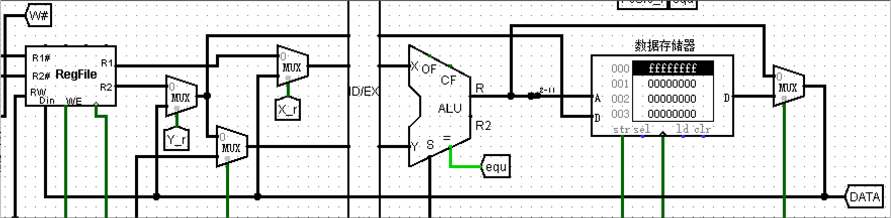

# COA-Labyrinth
 **选题及要求**

基于 MIPS 处理器的应用系统开发-2（难度等级：A）  

结合 MIPS 处理器和 MIPS 汇编程序开发一个小型游戏机。游戏的主题和方式不限，可以由你自由设计。这个游戏机至少应该使用到 Logisim 提供的三种输入外设之一（按钮/摇杆/键盘）作为输入，至少应该使用到 Logisim 提供的三种输出外 设之一（数码管/点阵屏/终端）作为输出。你的硬件系统将以自己设计的 MIPS 处 理器为核心，通过内存映射的方式挂载外设；你的软件系统将以 MIPS 汇编程序为 核心，通过 SW/LW 访问外设，并通过其他算术指令完成数据的计算、控制流等。 

在此基础之上，进一步使用流水线并行和中断机制对系统进行优化。在正确展示系统功能的基础之上，提供优化效果的分析。 

你需要在课程设计报告中描述：（1）**设计目标与设计思路**；（2）**核心功能模块的实现方法**；（3）**验证功能是否正确的测试方法并提供测试示例**；（4）**采用了优化策略后的优化效果分析**。

 

## 一、 设计目标与设计思路

设计目标：结合MIPS处理器和MIPS汇编程序开发一个**小型走迷宫游戏，并使用三级流水线、中断机制、数据旁路和分支跳转预测对系统进行优化**。

设计思路：（1）将用于初始化的32X32迷宫信息和游戏成功的显示信息，存储到数据存储器中，并将其中的一个寄存器（$2）映射成将信息输出到外设的地址（2）使用按钮作为输出外设，并以此来触发中断控制，实现通过按钮控制物体在迷宫中进行移动。（3）将物体的初始地点设置在左上角，迷宫的出口设置右侧，因此只需在物体进行右移中断时，判断物体是否到达出口，若到达则游戏成功，并显示游戏成功的画面。

 

## 二、核心功能模块的实现方法

核心功能模块主要分成：

核心功能模块主要分成：控制器、32X32点阵屏显示、中断触发

### 译码电路：


根据所编写的MIPS 汇编程序所用到的操作码，设计对应的译码电路

首先根据操作码确定执行的操作符


 

 


|      | RegDst | RegWrite | ALUSrc | ALU_OP | MemWrite | MemtoReg | PcSrc | IsJ  | Move | ERET |
| ---- | ------ | -------- | ------ | ------ | -------- | -------- | ----- | ---- | ---- | ---- |
| LW   | 0      | 1        | 1      | 0101   | 0        | 1        | 0     | 0    | 0    | 0    |
| SW   | X      | 0        | 1      | 0101   | 1        | X        | 0     | 0    | 0    | 0    |
| ADD  | 1      | 1        | 0      | 0101   | 0        | 0        | 0     | 0    | 0    | 0    |
| ADDI | 0      | 1        | 1      | 0101   | 0        | 0        | 0     | 0    | 0    | 0    |
| SUB  | 1      | 1        | 0      | 0110   | 0        | 0        | 0     | 0    | 0    | 0    |
| OR   | 1      | 1        | 0      | 1000   | 0        | 0        | 0     | 0    | 0    | 0    |
| AND  | 1      | 1        | 0      | 0111   | 0        | 0        | 0     | 0    | 0    | 0    |
| SLL  | 1      | 1        | 1      | 0000   | 0        | 0        | 0     | 0    | 1    | 0    |
| SRL  | 1      | 1        | 1      | 0010   | 0        | 0        | 0     | 0    | 1    | 0    |
| J    | X      | 0        | 1      | X      | 0        | X        | 0     | 1    | 0    | 0    |
| BEQ  | X      | 0        | 0      | X      | 0        | X        | 1     | 0    | 0    | 0    |
| ERET | 0      | 0        | 0      | 0      | 0        | 0        | 0     | 0    | 0    | 1    |

使用上述表格，并通过真值表构建译码电路。


### 32X32 LED点阵屏显示：

 

 

 

通过32个32位的寄存器来存储32X32的LED点阵屏的显示信息，LED点阵屏的显示信息的更新需要按行进行更新操作，并且每次需四个输入信息：输出到外设的数据、进行更行的行数、外设写使能端、时钟

（1）时钟：每一次时钟上升沿触发一次显示信息更新

（2）外设写使能端：当且仅当lw指令的目的操作数为$2时PeriWrite为1，才可进行LED点阵屏显示信息的更新。

（3）进行更行的行数：在进行显示信息的更新之前需确定需要更新的显示信息的所在行，而一条指令执行只产生一个结果，所以先使用寄存器保存需要更新的显示信息的所在行。故addi $1,$5,0与lw $2,0($7)先后执行，完成一行显示信息的更新。

（4）输出到外设的数据：通过lw指令从存储器中读取更行所需的行信息。

 

### 中断触发：

 

 


当上、下、左、右任意一个按钮按下发出Interrupt信号

 

 

         

 

当任意中断触发时，发出Interrupt信号，IF/ID暂定，ID/EX清空，再根据不同的中断信号进入不同的中断子程序，执行中断。

 

 

 

### 四个中断：

（1）上移中断/下移中断

```assembly
################上移判断################
up:
addi $10,$7,0              #另存迷宫你所在行的地址
addi $11,$3,0		      #另存迷宫所在行的信息

addi $7,$7,-4			#迷宫up行所在地址
lw $3,0($7)			#迷宫up所在行信息
addi $5,$5,-1			#迷宫up所在行

and $9,$3,$4			#判断与up是否相撞

beq $9,$0,moveup		#不相撞则跳转至moveup
noup:
addi $7,$7,4			
lw $3,0($7)
addi $5,$5,1			#恢复到迷宫原来的信息
j endup
moveup:
sub $11,$11,$4		#移动后的原先行信息变化
sw $11,0($10)			#保存移动后的原先行信息变化

addi $1,$5,1
lw $2,0($10)			#信息输入外设	

or $3,$3,$4			#移动后up行信息
sw $3,0($7)			#保存up行的信息

addi $1,$5,0			
lw $2,0($7)			#信息输入外设

addi $6,$6,-1			#物体所在行
endup:
eret
```

获取物体所在行的上一行的迷宫信息，并与物体的行信息按位进行与运算（and）若运算结果为0则说明两者没有重叠部分，即物体进行向上移动时，物体不与迷宫相撞，然后将物体从当前行拿出（sub），再通过物体信息与上一行的迷宫信息按位进行或运算（or）实现物体向上移动。反之，若运算结果不为0则说明两者相撞，物体不向上移动，同理可实现下移中断。

 

 

 

（2）左移中断/右移中断

```assembly
################左移判断################
left:
sll $10,$4,1			#将物体信息左移
and $9,$3,$10   		#判断与left是否相撞
beq $9,$0,moveleft
noleft:
j endleft
moveleft:
sub $3,$3,$4			#取出物体
sll $4,$4,1			#物体左移
sw $4,0($8)			#保存物体信息
or $3,$3,$4			#物体放入迷宫
sw $3,0($7)			#保存迷宫所在行信息

addi $1,$5,0			
lw $2,0($7)			#信息输入外设
endleft:
eret 
```

将物体先左一格，并与物体所在行的迷宫信息按位进行与运算（and）若运算结果为0这说明两者没有重叠部分，即物体进行向左移动时，物体不与迷宫相撞，并将物体的信息从所在行的迷宫信息中拿出，后物体信息进行左移，再与所在行的迷宫信息按位进行或运算（or）得到物体左移后的迷宫行信息。反之，若运算结果不为0则说明两者相撞，物体不向左移动。

 ```assembly
 ################找到出口判断################
 success:
 endstart:
 addi $12,$0,1
 la $7,Successdata
 addi $1,$0,-1
 addi $9,$0,31
 
 endinterface:
 addi $1,$1,1
 lw $2,0($7)
 addi $7,$7,4
 beq $1,$9,endsuccess
 j endinterface
 
 endsuccess:
 eret
 ```


与左移中断同理可实现右移中断，**右移中断增加了找到出口判断**，如果成功右移后，再判断物体是否移动到了出口，若到达出口则进行程序执行成功的界面显示。

 

 

 

 

## 三、验证功能是否正确的测试方法并提供测试示例

 

如上图所示当按下按钮W、A、S时，因为此时的上、下、左三个方向都都存在障碍物，所以物体不移动，当当按下D时，因为右方不存在障碍物，所以物体向右移动，通过观察32X32点阵屏显示的结果来判断物体是否正确移动。

 


通过观察物体达到出口时是否正常显示（SUCCESS!)界面判断是否实现物体到达出口判断。

 

## 四、采用了优化策略后的优化效果分析

 

首先将 MIPS 处理器分割成三级流水线。

（1）分支跳转预测

未进行分支跳转预测时，当执行阶段执行的跳转指令时，则需暂停IF/ID，并清空ID/EX,再取出跳转后的目的指令，进行指令处理，而根据在MIPS处理器在实际运行时，跳转指令是否跳转的概率大小，可以进行跳转预测，提高MIPS处理器执行程序的效率。

 

 

 

 

对于`beq，$0,$0,loop` 预测为跳转

 

 

 

由于j型指令必然跳转，所以对于j型默认预测为跳转

 

（2）**数据旁路**

由于将MIPS处理器划分成三级流水线时，若译码阶段使用的寄存器同时是执行阶段的目的寄存器，将有可能造成接下来程序执行的数据错误，即数据冒险。

若使用让执行阶段先执行完，再进行取指和译码来解决数据冒险，则无疑会降低程序的效率，而使用数据旁路，可避免这一问题。

 

 

首先通过左图电路判断译码阶段的哪一个寄存器会发生数据冒险。

 

 

通过复用器用执行阶段的结果替换发生数据的寄存器数据，来解决数据冒险。

 
